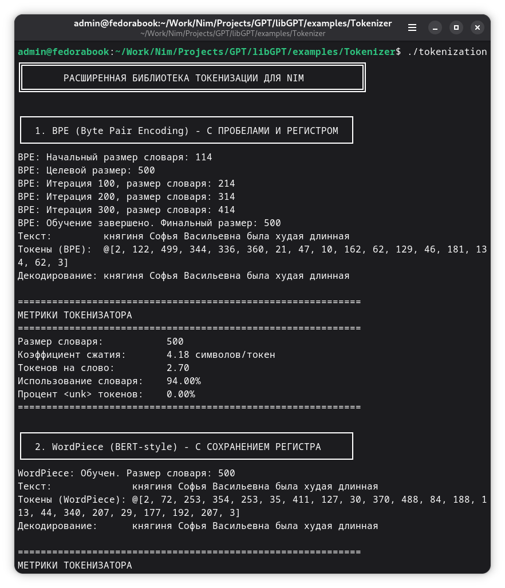

# libGPT
libGPT is a well-structured Nim library that implements a full cycle of working with GPT-like models.

libGPT — это вычислительно эффективная хорошо структурированная библиотека на Nim, реализующая полный цикл работы с GPT-подобными моделями.

**Work in progress! Not for using.**

## Основные характеристики библиотеки

- Чистая реализация GPT на Nim для глубокого обучения без необходимости установки сторонних библиотек и инструментария
- Поддержка обучения с нуля и генерации текста
- Модульная структура, удобная для понимания и модификации

## Testing the GPT library

## Структура модулей и их назначение

| Файл              | Основная ответственность                                | Ключевые сущности / функции                              |
|-------------------|---------------------------------------------------------|------------------------------------------------------------|
| `tokenization.nim`| Токенизация текста: BPE, WordPiece, SentencePiece       | tokenizer, encode, decode, vocab, merges                   |
| `attention.nim`   | Механизмы внимания (в первую очередь causal multi-head) | scaledDotProductAttention, multiHeadAttention, causal mask |
| `layers.nim`      | Основные строительные блоки преобразователя             | transformerBlock / decoderLayer, feedForward, layerNorm    |
| `model.nim`       | Главная модель GPT                                      | gptConfig, gptModel, forward, generate, load/save          |
| `generation.nim`  | Алгоритмы генерации текста                              | sample, top_k, top_p, temperature, greedy, beam search|
| `loss.nim`        | Функции потерь                                          | crossEntropyLoss, label smoothing              |
| `training.nim`    | Логика обучения модели                                  | train_step, trainer / loop, optimizer calls, gradient calc |
| `utils.nim`       | Вспомогательные утилиты                                 | log, random, tensor ops, save/load weights, metrics        |

## Usage
`nimble install https://github.com/Balans097/libGPT`

